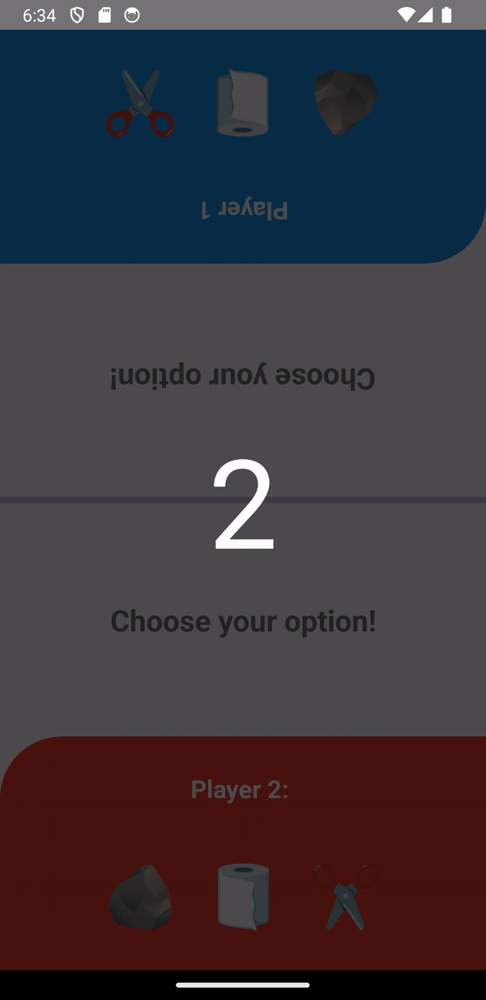

# Rock Paper Scissors Game - React Native App

This project is a simple Rock Paper Scissors game built with React Native. The game allows two players to select their choices and determines the winner based on classic Rock Paper Scissors rules. The app also features a countdown timer before each game round starts.

## Features

- Two-player mode
- Rock, Paper, Scissors choices
- Countdown timer before each game round
- Displays the winner with respective color coding
- Reset functionality to play again

## Demo



## Installation

To get started with this project, follow these steps:

1. **Clone the repository:**

   ```bash
   git clone https://github.com/sabarikennady/rockpaperscissors.git
   ```

2. **Navigate to the project directory:**

   ```bash
   cd rockpaperscissors
   ```

3. **Install the dependencies:**

   ```bash
   npm install
   ```

4. **Run the app:**

   For iOS:

   ```bash
   yarn ios
   ```

   For Android:

   ```bash
   yarn android
   ```

## Usage

- **Start the Game:** The game starts with a 3-second countdown timer.
- **Player Choices:** Each player selects Rock, Paper, or Scissors by tapping on the respective icons.
- **Determine Winner:** The app will display the result and highlight the winner's color.
- **Reset Game:** Tap on "Play Again" to reset the game and start a new round.

## Code Explanation

### State Variables

- `player1Choice` and `player2Choice`: Store the choices made by Player 1 and Player 2.
- `winnerColor`: Stores the color associated with the winner.
- `result`: Stores the result of the game.
- `showCountdown`: Controls the visibility of the countdown timer.
- `countdown`: Stores the current value of the countdown timer.

### useEffect Hooks

- **Determine Winner:** Triggered when player choices are updated and countdown is complete.
- **Countdown Timer:** Handles the countdown logic and updates the state accordingly.

### Functions

- `handlePlayerChoice(player, choice)`: Sets the choice for the specified player.
- `determineWinner()`: Determines the winner based on player choices.
- `resetGame()`: Resets the game state for a new round.

### UI Components

- **Player Sections:** Sections for Player 1 and Player 2 with their respective choice buttons.
- **Result Section:** Displays the game result and provides a reset button.
- **Countdown Modal:** Displays the countdown timer before the game starts.

## Styling

The app uses `StyleSheet` for styling the components, with distinct styles for player sections, choice buttons, result display, and the countdown modal.

## Contributing

If you wish to contribute to this project, please follow these steps:

1. **Fork the repository**
2. **Create a new branch**
3. **Make your changes**
4. **Submit a pull request**

## License

This project is licensed under the MIT License. See the [LICENSE](LICENSE) file for details.
